# NXP-Cup Autonomous Car

A ready-to-apply README upgrade draft for the NXP Cup EXPO project using copied v4 assets and Mid-Term Report evidence. This file exists because the upstream repo was not updated directly in this session.

## System overview

  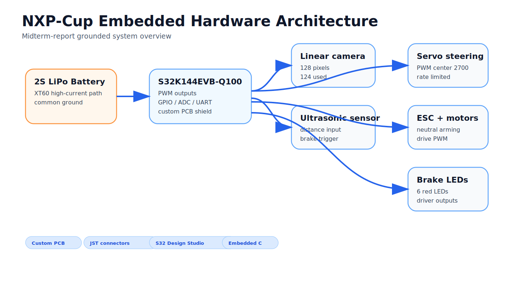

Camera-guided autonomous model car using embedded control, a linear camera pipeline, custom PCB integration, ultrasonic safety handling, and on-device tuning and debugging flows.

## Real build evidence

<table>
  <tr>
    <td width="33%" valign="top">
      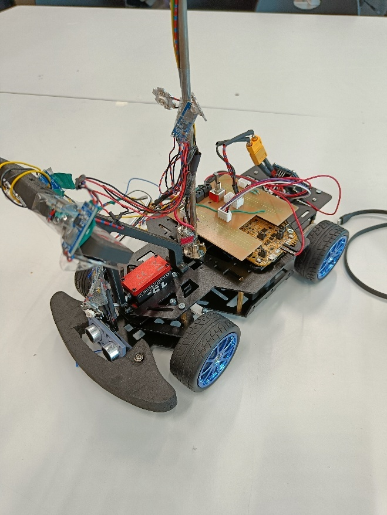 
      <strong>Car overview</strong>
    </td>
    <td width="33%" valign="top">
      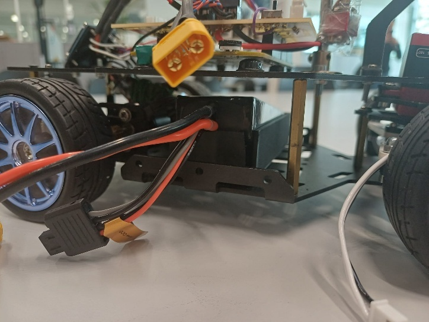 
      <strong>Battery holder</strong>
    </td>
    <td width="33%" valign="top">
      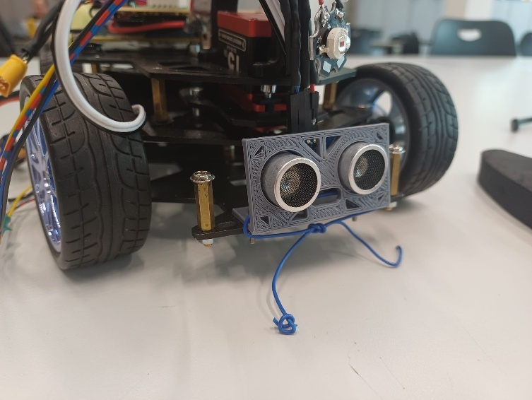 
      <strong>Ultrasonic mount</strong>
    </td>
  </tr>
</table>

## Electronics and control visuals

<table>
  <tr>
    <td width="33%" valign="top">
      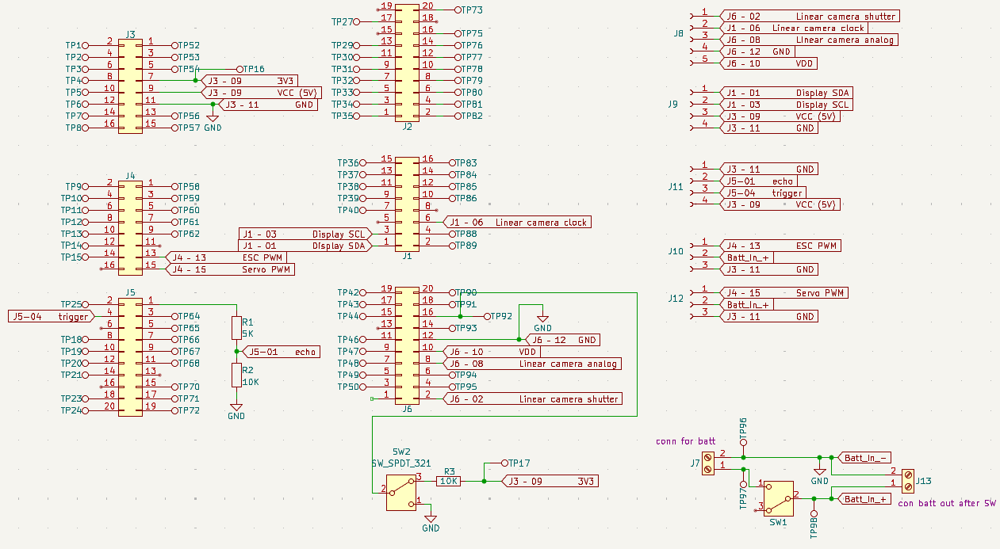 
      <strong>PCB schematic</strong>
    </td>
    <td width="33%" valign="top">
      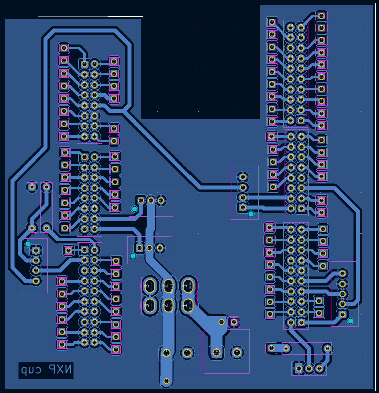 
      <strong>PCB layout</strong>
    </td>
    <td width="33%" valign="top">
      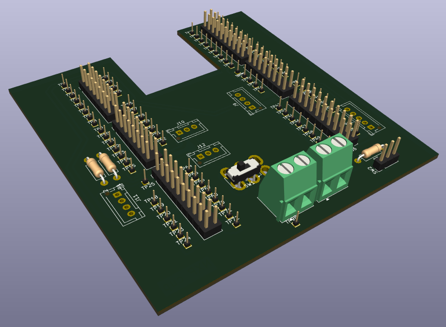 
      <strong>PCB 3D render</strong>
    </td>
  </tr>
</table>

## Vision and safety pipeline

  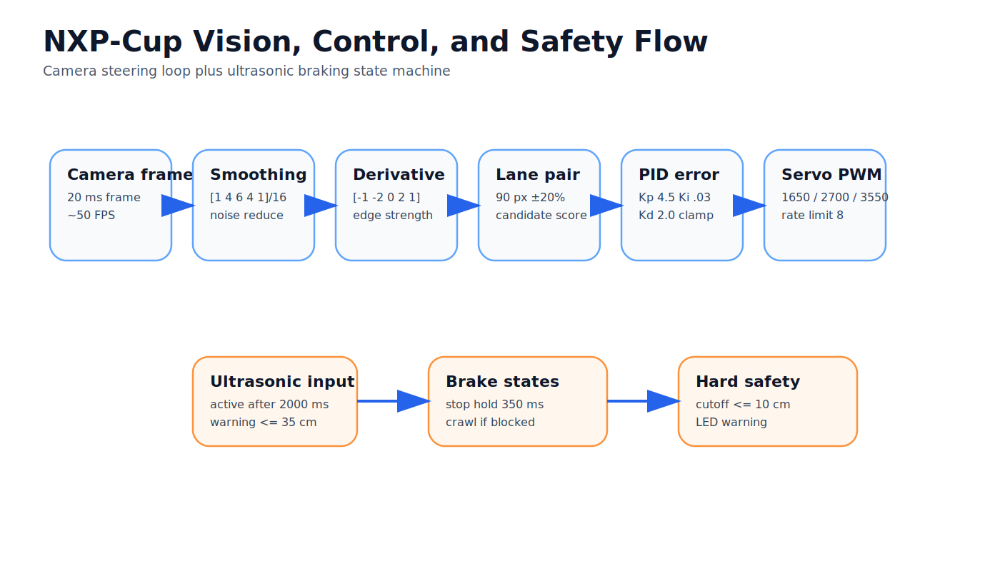

<table>
  <tr>
    <td width="50%" valign="top">
      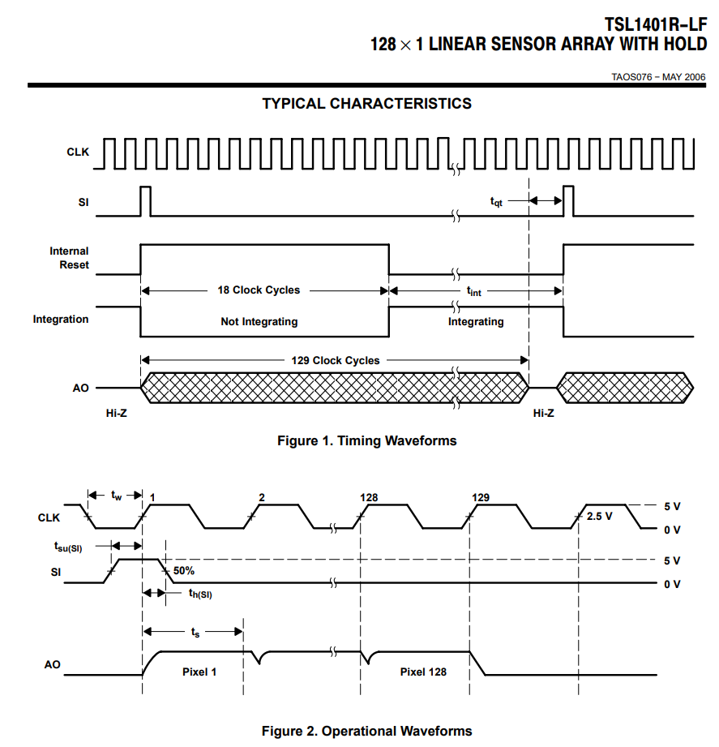 
      <strong>Linear camera timing</strong>
    </td>
    <td width="50%" valign="top">
      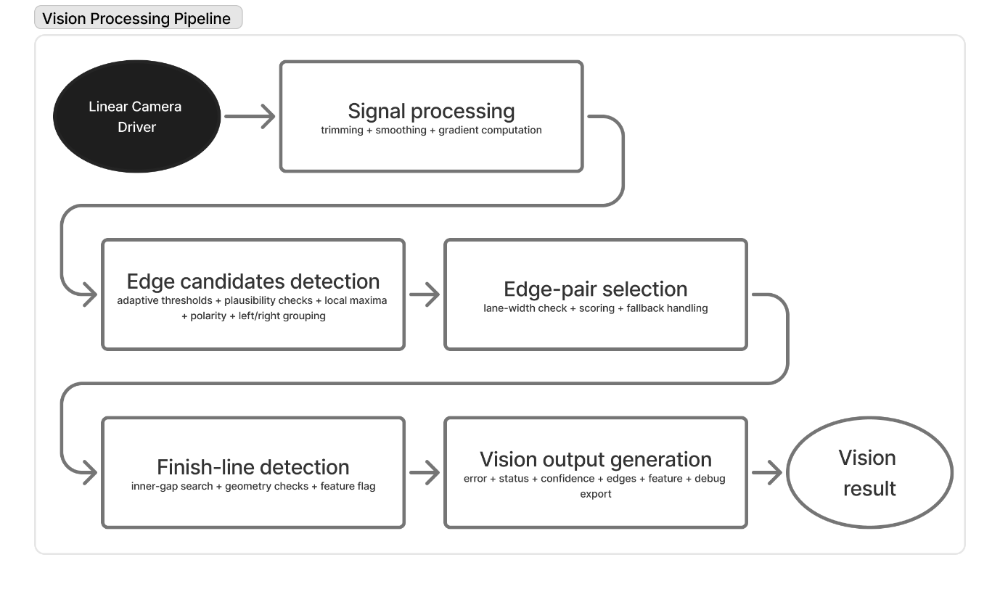 
      <strong>Vision processing pipeline</strong>
    </td>
  </tr>
</table>

## Evidence flowcharts

<strong>Mid-Term Report control and debug flowcharts</strong>

 

<table>
  <tr>
    <td width="50%" valign="top">
      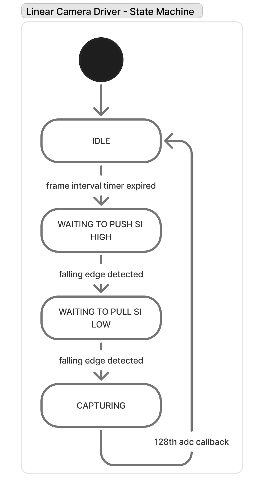 
      <strong>Linear camera driver</strong>
    </td>
    <td width="50%" valign="top">
      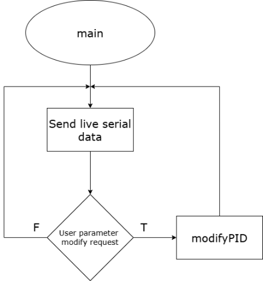 
      <strong>Serial debug main</strong>
    </td>
  </tr>
  <tr>
    <td width="50%" valign="top">
      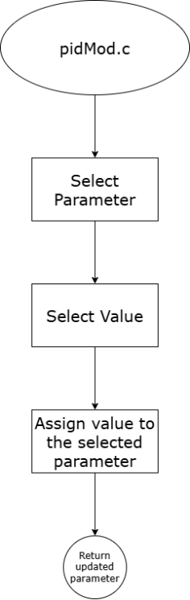 
      <strong>Modify PID menu</strong>
    </td>
    <td width="50%" valign="top">
      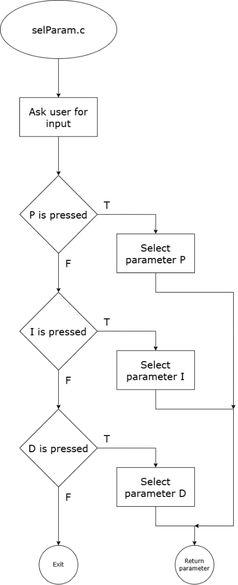 
      <strong>Select parameter</strong>
    </td>
  </tr>
  <tr>
    <td width="50%" valign="top">
      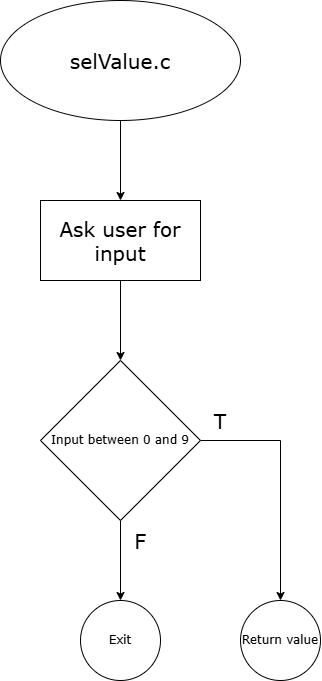 
      <strong>Select value</strong>
    </td>
    <td width="50%" valign="top">
      Evidence copied from the v4 visual asset pack Mid-Term Report image set.
    </td>
  </tr>
</table>

## Limitations and next improvements

- This draft uses available copied visuals and report evidence only
- No lap times, fake metrics, or unsupported claims are added
- Upstream application still needs repo access or maintainer approval
